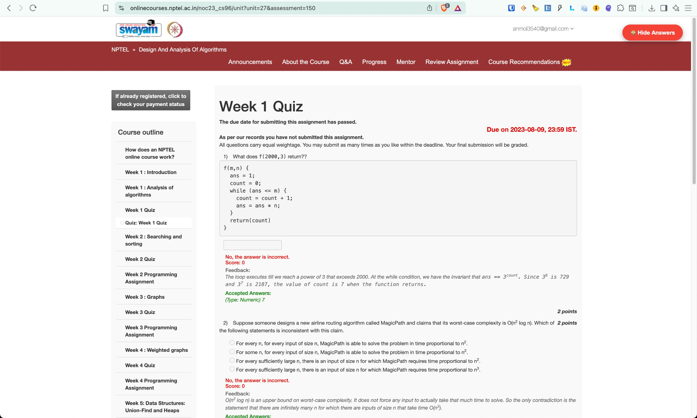
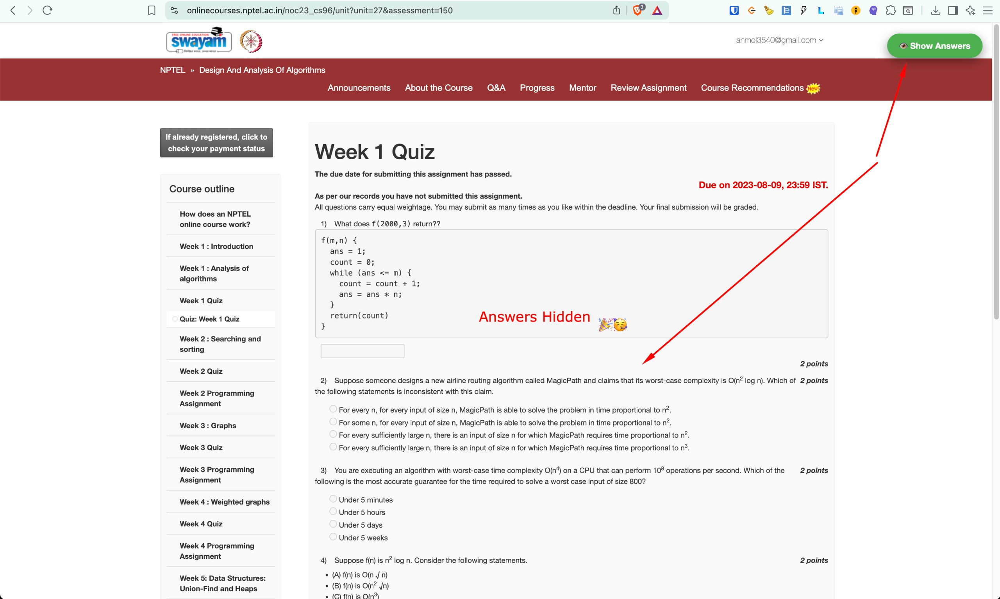

# NPTEL Quiz Answer Hide Extension

This is a Chrome extension designed to enhance your experience when studying NPTEL courses, especially in scenarios such as:
- You are taking a self-paced course,
- The course is over, or
- The course is on Week x+3 while you are working on Week x.

## Problem

NPTEL typically displays quiz answers on the page after the due date has passed or if you missed a quiz. For those who like to audit courses and check their own answers, this can spoil the self-testing experience.

## Solution

This extension automatically detects when you are on a quiz page and adds a functionality (via an overlay button) to display or hide the answers shown on the page. This is particularly helpful for learners who want to challenge themselves before viewing the official answers.

- YT Video - https://www.youtube.com/watch?v=nsGRaBxfVm8

---

**Perfect for anyone who prefers to audit courses but still wants the option to check quiz answers at their own pace!**
